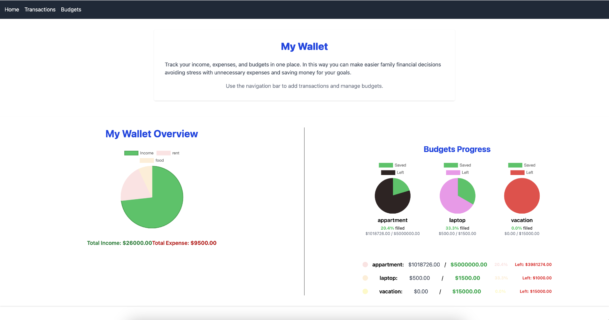
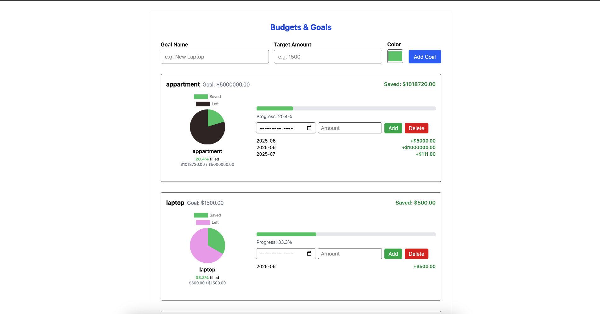
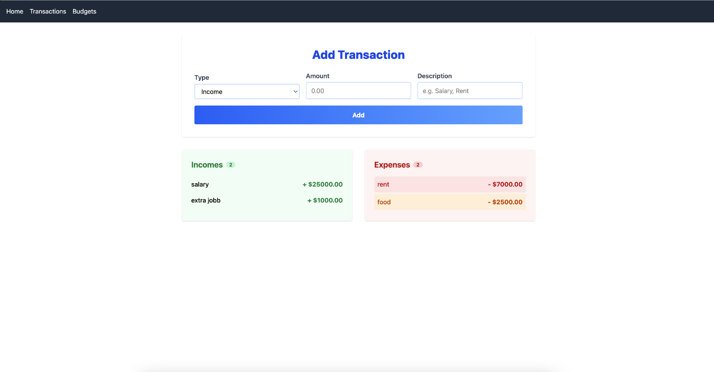

# MyWallet

**MyWallet** is a modern personal finance dashboard built with React, TypeScript, Redux Toolkit, Chart.js, and Tailwind CSS. It helps you track your income, expenses, and savings goals with beautiful charts and a user-friendly interface.

## 🚀 Live Demo

[Visit the app on AWS Amplify](https://main.d2gmgx6w7svcr0.amplifyapp.com)

---

## 🛠️ Tech Stack

- **React** (with Vite) — Fast, modern UI library for building interactive interfaces.
- **TypeScript** — Type-safe JavaScript for better code quality and maintainability.
- **Redux Toolkit** — State management for transactions, budgets, and savings.
- **React Redux** — Connects Redux state to React components.
- **React Router DOM** — Client-side routing for multi-page navigation.
- **Chart.js & react-chartjs-2** — Interactive charts (Pie, Line) for financial visualization.
- **Tailwind CSS** — Utility-first CSS framework for rapid, responsive design.
- **LocalStorage** — Persists transactions and budgets in the browser.
- **AWS Amplify** — Cloud hosting and CI/CD for seamless deployment.

---

## ✨ Features

- **Add, view, and delete transactions** (income & expenses)
- **Visualize finances** with Pie and Line charts
- **Create and manage budgets/goals** with progress tracking
- **Assign custom colors** to each budget and savings progress
- **Monthly savings tracking** for each goal
- **Responsive design** for desktop and mobile
- **Persistent data** using browser localStorage

---

## 📦 Project Structure

```
myWallet/
  ├── src/
  │   ├── components/      # Reusable UI components (NavBar, BudgetPie, etc.)
  │   ├── pages/           # Page components (Home, Budgets, TransactionForm, etc.)
  │   ├── store/           # Redux slices and store setup
  │   ├── App.tsx
  │   └── Router.tsx
  ├── public/
  ├── package.json
  ├── tailwind.config.js
  └── vite.config.ts
```

---

## 🏗️ How to Run Locally

```bash
cd myWallet
npm install
npm run dev
```
Visit [http://localhost:5173](http://localhost:5173) in your browser.

---

## 📝 Deployment

- **AWS Amplify** is used for CI/CD and hosting.
- The build output is in `myWallet/dist`.
- Build command: `npm run build` (or `cd myWallet && npm install && npm run build` if deploying from the repo root).

---

## 📊 Screenshots





---

## 👨‍💻 Author

- [Lucas Eduardo](https://github.com/LucasEdwa)

---

## 📃 License

MIT